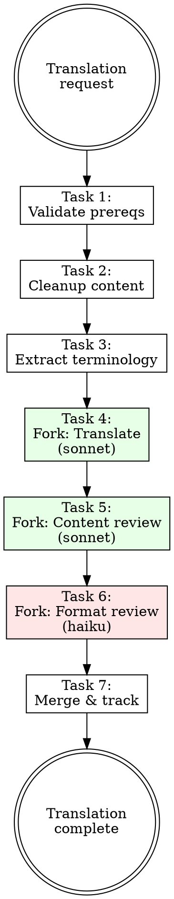

# Optimized Translating

## Overview

**Optimized translating IS systematic linear chain workflow that eliminates review inefficiencies.**

Replace multi-loop review cycles with cost-optimized model routing: sonnet for translation/review, haiku for formatting. Immediate formatting prevents downstream processing problems.

**Core principle:** Separate concerns with appropriate model assignment. Translation ≠ formatting ≠ review.

**Violating the letter of the rules is violating the spirit of the rules.**

## Routing

**Pattern:** Chain
**Handoff:** user-confirmation
**Next:** none

## Task Initialization (MANDATORY)

Before ANY action, create task list using TaskCreate:

```
TaskCreate for EACH task below:
- Subject: "[optimized-translating] Task N: <action>"
- ActiveForm: "<doing action>"
```

**Tasks:**
1. Validate prerequisites
2. Cleanup source content
3. Extract terminology
4. Fork: Translate (sonnet)
5. Fork: Content review (sonnet)
6. Fork: Format review (haiku)
7. Merge and track progress

Announce: "Created 7 tasks. Starting execution..."

**Execution rules:**
1. `TaskUpdate status="in_progress"` BEFORE starting each task
2. `TaskUpdate status="completed"` ONLY after verification passes
3. If task fails → stay in_progress, diagnose, retry
4. NEVER skip to next task until current is completed
5. At end, `TaskList` to confirm all completed

## Task 1: Validate Prerequisites

**Goal:** Ensure project setup supports optimized translation.

**Verification checklist:**
- [ ] `glossary.json` exists and is readable
- [ ] `style-decisions.json` exists
- [ ] Target content identified and accessible
- [ ] Previous translation progress documented

**Verification:** All prerequisites checked and documented.

## Task 2: Cleanup Source Content

**Goal:** Prepare source material for efficient processing.

**Actions:**
- Remove markup artifacts and formatting noise
- Standardize heading structures  
- Identify and mark special elements (tables, code blocks)
- Extract metadata for context

**Verification:** Source content is clean and structured.

## Task 3: Extract Terminology

**Goal:** Validate terminology consistency before translation begins.

**Process:**
1. Scan content for terminology requiring decisions
2. Cross-reference against existing `glossary.json`
3. Flag unknown terms for user review
4. Update glossary if new terms approved

**Verification:** All terminology validated or flagged for review.

## Task 4: Fork: Translate (sonnet)

**Goal:** High-quality translation using cost-appropriate model.

**CRITICAL:** Use Agent tool with sonnet model for translation work.

**Instructions for translation agent:**
- Focus purely on semantic accuracy
- Apply glossary terms consistently
- Maintain source structure
- Traditional Chinese (Taiwan usage)
- Do NOT format or review—translation only

**Verification:** Translation completed, semantically accurate, terminology consistent.

## Task 5: Fork: Content Review (sonnet)

**Goal:** Content quality validation using cost-appropriate model.

**CRITICAL:** Use Agent tool with sonnet model for content review.

**Instructions for review agent:**
- Review translation for accuracy and readability
- Verify terminology consistency
- Check cultural adaptation appropriateness  
- Flag any semantic issues for correction
- Do NOT format—content review only

**Verification:** Content reviewed, issues flagged or corrected.

## Task 6: Fork: Format Review (haiku)

**Goal:** Structure and formatting using cost-optimized model.

**CRITICAL:** Use Agent tool with haiku model for formatting work.

**Instructions for format agent:**
- Apply Starlight markdown formatting
- Convert page references to internal links
- Ensure heading hierarchy compliance
- Apply Traditional Chinese punctuation rules
- Validate frontmatter structure

**Verification:** Formatting complete, structure validated.

## Task 7: Merge and Track Progress

**Goal:** Integrate results and update progress tracking.

**Actions:**
- Merge translation, content fixes, and formatting
- Update progress tracker with completion status
- Create summary of work completed
- Prepare handoff documentation

**Verification:** Results merged, progress updated, ready for user review.

## Red Flags - STOP

These thoughts mean you're rationalizing. STOP and reconsider:

- "Skip the fork steps, do it all at once"
- "Sonnet for formatting is fine, costs don't matter"
- "Multiple review rounds will improve quality"
- "Combine translation and review into one step"
- "Skip terminology extraction, it's obvious"
- "Format later, focus on translation first"

**All of these mean: You're about to recreate the inefficiencies this skill prevents.**

## Common Rationalizations

| Excuse | Reality |
|--------|---------|
| "All-in-one is faster" | All-in-one creates context pollution and review cycles. |
| "Costs are negligible" | Sonnet for formatting = 3x cost for structural work. |
| "More review = better" | Multiple reviews create fatigue and diminishing returns. |
| "Format later works" | Late formatting requires re-translation when structure conflicts arise. |
| "Terminology is obvious" | Inconsistent terms compound across large documents. |

## Workflow Pattern



## References

- [references/workflow-pattern.md](references/workflow-pattern.md) - Detailed translation flow
- [templates/progress-tracker.json](templates/progress-tracker.json) - Progress state template