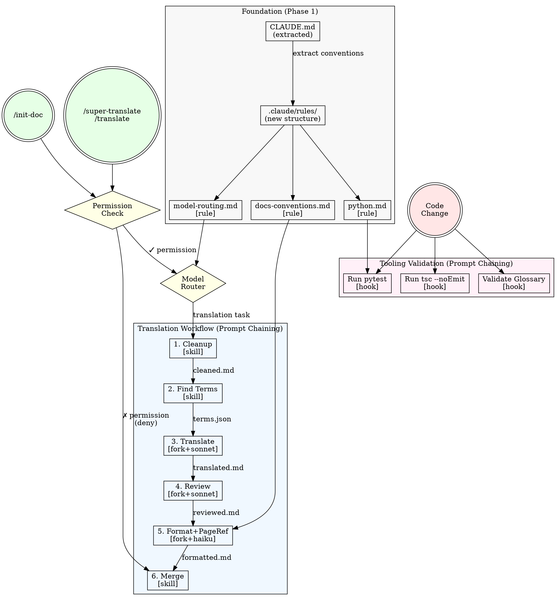

# Agent System Component Plan

**Date:** 2026-04-11 01:16
**Based on:** docs/agent-system/20260411-0053-analysis.md + docs/agent-system/20260411-0111-workflows.md

## Architecture Flowchart

## Workflow Pattern Mapping

| Workflow | Anthropic Pattern | Rationale |
|----------|------------------|-----------|
| Optimized Translation Flow | Prompt Chaining | Sequential steps where each transforms previous output: 清理→術語→翻譯(sonnet)→review(sonnet)→format(haiku)→合併 |
| Permission Management | Routing | Input classification: check agent write permissions → route to execute or deny |
| Model Selection | Routing | Input classification: task type → route to sonnet (translation/review) or haiku (format) |
| Tooling Validation | Prompt Chaining | Sequential: code change → run pytest/tsc → report results |

## Dependency Graph & Phases

| Component | Depends On | Depended By | Phase | Core/Enhancement |
|-----------|-----------|-------------|-------|-----------------|
| CLAUDE.md (modified) | (none) | .claude/rules/ | 1 | **Core** |
| .claude/rules/ (directory) | CLAUDE.md | all rule files | 1 | **Core** |
| docs-conventions.md | .claude/rules/ | format_fork | 1 | **Core** |
| python.md | .claude/rules/ | pytest_hook | 1 | **Core** |
| model-routing.md | .claude/rules/ | model_router | 1 | **Core** |
| permission-check.sh | .claude/rules/ | all workflows | 2 | **Core** |
| pytest.sh | python.md | (none) | 2 | **Core** |
| optimized-translate skill | model-routing.md | (none) | 3 | **Core** |
| terminology-validate.sh | .claude/rules/ | translation workflow | 2 | Enhancement |
| typescript-check.sh | .claude/rules/ | (none) | 2 | Enhancement |
| routing patterns (14 skills) | (none) | (none) | 3 | Enhancement |

## Execution Order

Phase-driven (components within a phase can be built in parallel):

- **Phase 1 (foundation):** CLAUDE.md modification + .claude/rules/ directory + docs-conventions.md + python.md + model-routing.md
- **Phase 2 (automation):** permission-check.sh + pytest.sh + [optional: terminology-validate.sh + typescript-check.sh]  
- **Phase 3 (workflows):** optimized-translate skill + [optional: routing patterns for existing skills]

## Components

### 1. CLAUDE.md
- **Action:** modify
- **Key content:** 
  - Extract Integrated Conventions (lines 170-264) to reduce from 264→~90 lines
  - Keep Immutable Laws (1-66) and Quick Reference (68-168)
  - Add reference to new .claude/rules/ structure
- **Writing skill:** `writing-claude-md`
- **Traces to:** Analysis weakness "CLAUDE.md oversized (264 lines)" + session context reduction

### 2. Rule: docs-conventions.md
- **Action:** create
- **Paths:** `docs/src/content/docs/**/*.md`
- **Key constraints:**
  - Traditional Chinese (zh-TW) output requirement
  - Markdown formatting standards (frontmatter, headings, links, images)
  - Starlight component usage conventions
  - Translation style guidelines
- **Writing skill:** `writing-rules`
- **Traces to:** Workflow "Traditional Chinese output + markdown formatting" + extracted CLAUDE.md content

### 3. Rule: python.md
- **Action:** create
- **Paths:** `scripts/**/*.py`
- **Key constraints:**
  - Python project conventions (imports, functions, error handling)
  - Testing standards (pytest usage, test file naming)
  - Documentation requirements
- **Writing skill:** `writing-rules`
- **Traces to:** Analysis weakness "Python project with pytest but no Python-specific rules"

### 4. Rule: model-routing.md
- **Action:** create
- **Paths:** `.claude/skills/**/*.md`
- **Key constraints:**
  - Route translation tasks → sonnet model
  - Route content review tasks → sonnet model
  - Route format review tasks → haiku model
  - Route markdown structure tasks → haiku model
- **Writing skill:** `writing-rules`
- **Traces to:** Workflow "Model cost optimization" + user requirement "翻譯和review用sonnet，format用haiku"

### 5. Hook: permission-check.sh
- **Action:** create
- **Event:** PostToolUse
- **Key behavior:**
  - Validate write permissions before agent delegation
  - Block delegation if no write access
  - Log permission denials for debugging
- **Writing skill:** `writing-hooks`
- **Traces to:** Past failure "Agent經常沒有WRITE權限浪費一堆時間"

### 6. Hook: pytest.sh
- **Action:** create
- **Event:** PostToolUse (*.py files)
- **Key behavior:**
  - Run `uv run pytest` after Python file changes
  - Report test failures immediately
  - Skip hook if no test files exist
- **Writing skill:** `writing-hooks`
- **Traces to:** Analysis weakness "Python project but no PostToolUse hooks"

### 7. Skill: optimized-translate
- **Action:** create
- **Key workflow:**
  1. Cleanup source content
  2. Extract/validate terminology against glossary.json
  3. Fork context → translate with sonnet model
  4. Fork context → content review with sonnet model  
  5. Fork context → format review + page-ref conversion with haiku model
  6. Merge results with progress tracking
- **Assets needed:**
  - `references/workflow-pattern.md` - translation flow documentation
  - `templates/progress-tracker.json` - progress state template
- **Writing skill:** `writing-skills`
- **Traces to:** Workflow "Translation pipeline optimization" + user requirement for linear chain vs. multi-loop

### 8. Hook: terminology-validate.sh (Enhancement)
- **Action:** create
- **Event:** PostToolUse (before translation)
- **Key behavior:**
  - Validate glossary.json consistency before translation tasks
  - Check for undefined terms in source content
  - Block translation if critical terms missing
- **Writing skill:** `writing-hooks`
- **Traces to:** Workflow "Terminology consistency"

### 9. Hook: typescript-check.sh (Enhancement)
- **Action:** create
- **Event:** PostToolUse (*.ts files)
- **Key behavior:**
  - Run `tsc --noEmit` after TypeScript changes
  - Report type errors immediately
  - Skip hook if no tsconfig.json
- **Writing skill:** `writing-hooks`
- **Traces to:** Analysis weakness "TypeScript usage but no build verification hooks"

### 10. Routing Patterns: 14 existing skills (Enhancement)
- **Action:** modify
- **Key changes:**
  - Add `**Pattern:** Chain/Tree/Node` declaration to each SKILL.md
  - Add `**Handoff:** auto-invoke/user-confirmation` where needed
  - Add `**Next:** skill-name` for chain skills
- **Writing skill:** Manual edits to existing files
- **Traces to:** Analysis weakness "All 14 skills missing routing pattern declaration"

## Expected Fixes

| Weakness | Component | How It Fixes |
|----------|-----------|-------------|
| CLAUDE.md oversized (264 lines) | CLAUDE.md + docs-conventions.md | Extract Integrated Conventions to reduce session context |
| Python project but no rules/hooks | python.md + pytest.sh | Add Python conventions + automated testing |
| TypeScript usage but no verification | typescript-check.sh | Add automated type checking |
| Missing .claude/rules/ directory | .claude/rules/ + 3 rule files | Create proper rule architecture |
| Agent permission waste | permission-check.sh | Validate permissions before delegation |
| Translation multi-loop inefficiency | optimized-translate skill | Replace with linear chain workflow |
| Model cost inefficiency | model-routing.md | Route tasks to cost-appropriate models |
| Missing routing patterns | 14 skill modifications | Add Pattern declarations for clarity |
| Terminology inconsistency | terminology-validate.sh | Validate glossary before translation |
| Security hooks missing | permission-check.sh | Add input validation + sensitive file protection |

## Success Metrics

- **Context Reduction:** CLAUDE.md session load: 264 lines → ~90 lines (-66%)
- **Translation Efficiency:** Multi-loop cycles → single-pass linear chain
- **Cost Optimization:** Format tasks use haiku vs. sonnet (cost reduction)
- **Error Prevention:** Permission validation prevents wasted agent operations
- **Code Quality:** Automated pytest/tsc runs catch issues early